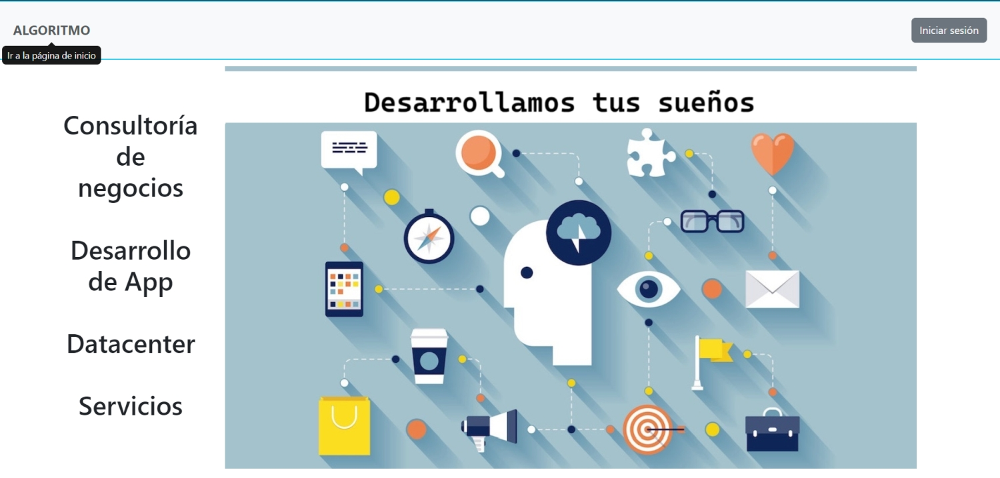

  

# Módulo 6 - Desafío 5
# Carlos Santana

Ruby on Rails - postgresql

## Descripción

Esta aplicación permite, para una empresa, que se creen ofertas de cargos internos de manera que los trabajadores puedan postular a ellos, mejorando así sus remuneraciones y ascendiendo a nuevos cargos dentro de la organización.

OBS:  
   1. La aplicación permite mostrar las vistas según el perfil del usuario (perfil normal, perfil owner y perfil admin).  
   2. El registro de las cuentas de usuario sólo las puede realizar el owner (o admin). En este caso, los campos curriculum y foto, quedan sin datos inicialmente.  
   3. Cada vez que el usuario ingrese a la aplicación con su email y password, y mientras no ingrese su curriculum y foto, se le mostrará un mensaje solicitando estos datos. Para hacer esta acción, se debe hacer click sobre su nombre en la barra de navegación y lo redijirá a la vista de modificación.  
   4. Sólo el usuario owner (o admin) puede crear ofertas de cargos, controlando la aplicación -en el navbar y en el controlador respectivo- las opciones autorizadas. Al crear una oferta se piden, entre otros campos:  
     - active: permite dejar activa o inactiva una oferta de cargo. Esto es útil para "bajar u ocultar" momentáneamente una oferta de cargo  
     - fecha límite: permite indicar la fecha límite para postular a la oferta de cargo.  
   5. Para postular a una oferta de cargo el usuario deberá -previamente- subir a su perfil su currículo y su foto.  
   6. Al postular es obligación indicar el motivo de dicha postulación. Una vez realizada esta acción, la postulación quedará con un indicador color rojo que le indica que aún no es vista por el owner (o admin). Cuando la postulación sea vista por el owner, el indicador pasará a verde. Lo mismo ocurre para la vista del owner (o admin).  
   7. En la vista del usuario, éste podrá ver las ofertas de cargos y el estado de sus postulaciones, pudiendo editarlas o eliminarlas.  
   8. En la vista del owner (o admin), éste podrá crear ofertas de cargos, ver las ofertas de cargos y editarlas o eliminarlas, y también podrá ver las postulaciones de los usuarios a las diferentes ofertas de cargos.  
   9. Cuando una visita ingresa a la aplicación, sólo tendrá acceso a una página de inicio.  
  
## Pantalla de inicio  
  
Vista para todos los usuarios al entrar a la aplicación. Está en /root y permite el inicio de sesión, siendo la única opción en el navbar. Si no tiene una cuenta creada, deberá solicitarla al owner (o admin).  
  
  
  
## Usuario owner (o admin) 
  
Esta es la vista del owner con las opciones disponibles (navbar) y, particularmente en esta ocación, con la vista de las ofertas de cargos con los postulantes -si existen-.  
  
  

## Usuario normal (trabajdor)  
Esta es la vista del usuario normal con las opciones disponibles (navbar) y, particularmente en esta ocación, con la vista de una de las ofertas de cargos a las cuales ha postulado.  
  
 
  
## Modelo de datos  
  

  
## Inicio
  
Estas instrucciones te ayudarán a obtener una copia del proyecto y a ejecutarlo en tu máquina local para fines de desarrollo y prueba.

### Pre-requisitos
  
Este proyecto fue desarrollado con Ruby versión 3.3.5, Rails - versión 7.2.1.1 y PostgreSQL - versión 16.4

### Instalación
  
Sigue estos pasos para ejecutar el proyecto localmente:
  
1. Clona este repositorio en tu máquina local.  
git clone https://github.com/crsantanag/m6d5.git  
  
2. Navega hasta el directorio del proyecto.  
cd m6d5  
  
3. Instala las dependencias y modifica archivo database.yml  
Las gemas que se deben instalar son:   
   - devise (autenticación)
   - figaro (configuración de variables ENV)  
   - activestorage (almacenamiento de imágenes). Instalar: rails active_storage:install  
   - font-awesome-sass (íconos) - renombrar archivo app/assets/stylesheet/application.css a app/assets/stylesheet/application.css.scss e incorporar @import "font-awesome"; dentro de él.  
  
4. Crea la base de datos, realiza la migración y carga los datos de prueba (ejecutar archivo seed.rb)  
    - rails db:create  
    - rails db:migrate  
    - rails db:seed ( seeds.rb tiene la creación del usuario con el rol de owner - revisar antes de ejecutar el comando)  
  
## Ejecutando las pruebas
Levanta el servidor y prueba la aplición.  
root está en /  
  
Este proyecto cuenta con pruebas automatizadas para el proceso de postulación. Revisar test/fixtures y test/models/postulation_test.rb   
   

  
Para ejecutar la prueba el comando es: rails test test/models/postulation_test.rb -n test_should_create_a_postulation  
  
Las otras puebas se pueden implementar, o bien, hacerlas manualmente. Hay datos para pruebas en seeds.rb  
  
## Licencia  
  
Este proyecto está bajo la Licencia MIT. Consulta el archivo [LICENSE.md](LICENSE.md) para obtener más detalles.  
  
⌨ ️Carlos Santana (https://github.com/crsantanag)